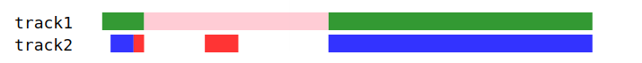

# vue-svg-tracks

## Synopsis

Vue component for displaying tracks



## Installation

npm install --save vue-svg-tracks

## Usage

~~~~
import { VueSvgTracks } from 'vue-svg-tracks';
~~~~

~~~~
<svg :width="width" :height="height">
      <svg-tracks
        :tracks="tracks"
        :length="length"
        :track-height="trackHeight"
        :sep="sep"
        :offset-x="offsetX"
      />
</svg>
~~~~


## Project setup
```
npm install
```

### Compiles and hot-reloads for development
```
npm run serve
```

### Compiles and minifies for production
```
npm run build
```

### Run your unit tests
```
npm run test:unit
```

### Lints and fixes files
```
npm run lint
```

### Customize configuration
See [Configuration Reference](https://cli.vuejs.org/config/).
